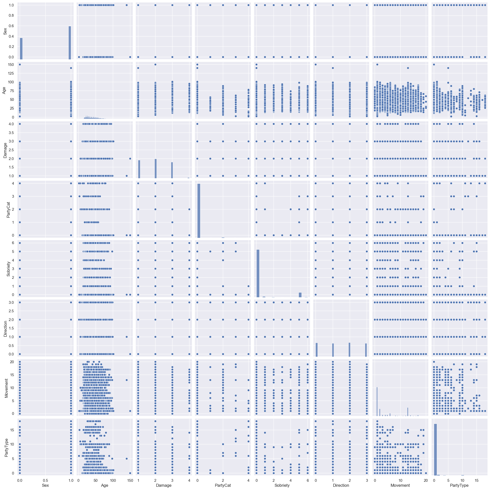
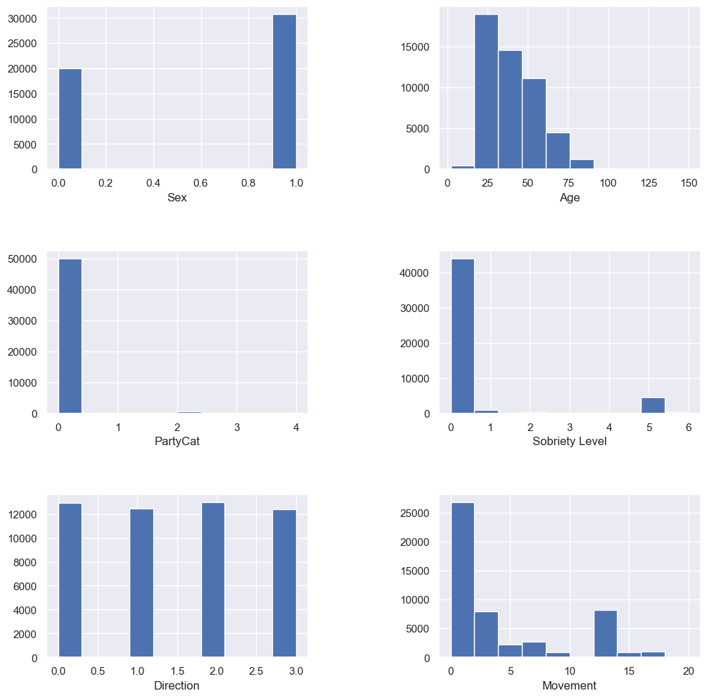
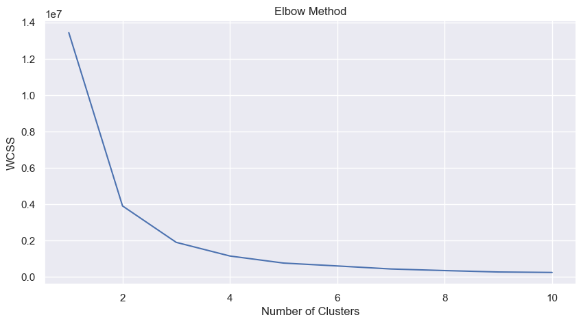
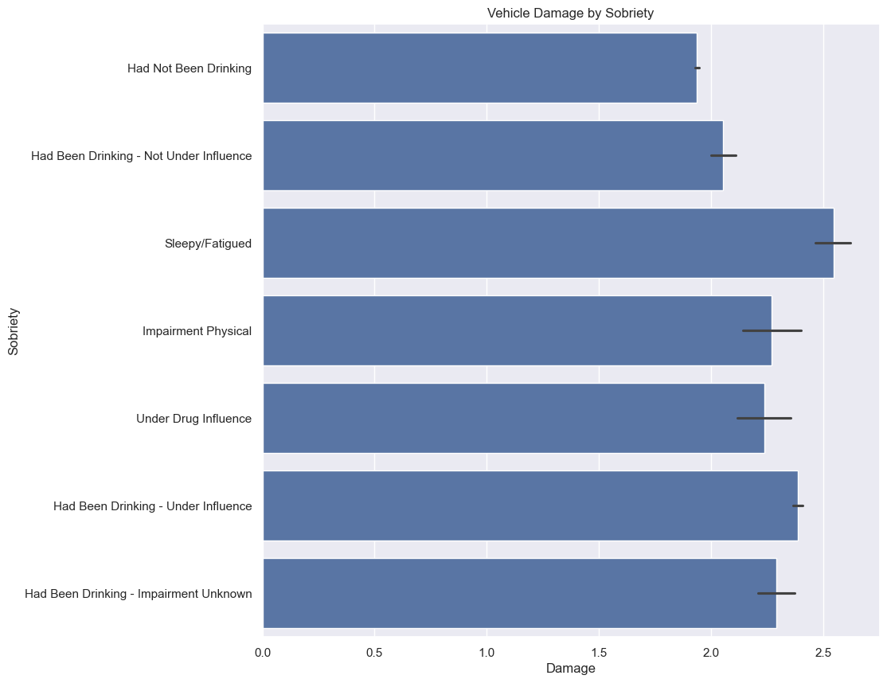

# Exploratory Study on Vehicle Crash Trends in San Jose, CA (2011-2023)
 Author: Austin Kim
 
 Published Date: 06/24/2023

## Introduction
This research aims to analyze vehicle crash incidents in San Jose, CA, from 2011 to June 18, 2023, using data from the [San Jose CA Open Data Portal](https://data.sanjoseca.gov/dataset/crashes-data). </br> This observatory study will address any concerns about traffic safety and the increase in vehicular accidents in the area.

## Background
The data for this research comes from two primary sources provided by the [San Jose CA Open Data Portal](https://data.sanjoseca.gov/dataset/crashes-data):
- [vehiclecrashdata2011-2020.csv](./vehiclecrashdata2011-2020.csv)
- [vehiclecrashdata2021-present.csv](./vehiclecrashdata2021-present.csv)

The study investigates several key questions:

1. Which vehicle type (PartyType) experiences the most severe vehicle damage?
2. Does sobriety impact the severity of vehicle damage?
3. Is there a correlation between the driver's sex and the severity of vehicle damage?
4. Which movements preceding collisions cause the most damage?
5. Which age group experiences the most severe vehicle damage?

An objective will also be in creating a model predicting vehicle damage based on the collected data.

## Analysis
The analysis begins by importing the necessary libraries and loading the CSV files into dataframes. After verifying that the columns are consistent across the files, the dataframes are concatenated into a single dataframe. Missing values are identified and addressed, with columns containing excessive missing data being dropped.

#### Importing Libraries


```python
import numpy as np
import pandas as pd

import matplotlib
import matplotlib.pyplot as plt
%matplotlib inline

import seaborn as sns

import warnings
warnings.filterwarnings('ignore')
```

Now let's import the csv file of the vehicle crash data provided by the San Jose CA Open Data portal. </br>
One file is from 2011 to 2020 while the other vehicle crash data is from 2021 to the present (as of June 18th 2023). </br>
I will verify that the columns are the same for both files and then combine them into one dataframe.


#### Data Preparation
The initial data prepartion includes: </br>
 + Dropping Columns with excessive values or irrelevant data </br>
 + Dropping rows with missin gvalues </br>
 + Converting categorical variables into numerical values


```python
dfs = [  # load all csv files into a list of dataframes
    pd.read_csv('vehiclecrashdata2011-2020.csv'),
    pd.read_csv('vehiclecrashdata2021-present.csv')
]

shapeY = dfs[0].shape[1]

for df in dfs:
    if shapeY != df.shape[1]:       # check if columns are the same for each df
        print('Columns are not the same')
    print('Shape of data below', df.shape)
    display(df.head())  # display each df head
```

    Shape of data below (115302, 15)
    


<div>

<table border="1" class="dataframe">
  <thead>
    <tr style="text-align: right;">
      <th></th>
      <th>CrashName</th>
      <th>Name</th>
      <th>Sex</th>
      <th>Age</th>
      <th>Speed</th>
      <th>VehicleDamage</th>
      <th>PartyCategory</th>
      <th>Sobriety</th>
      <th>VehicleDirection</th>
      <th>MovementPrecedingCollision</th>
      <th>PartyType</th>
      <th>OtherAssociatedFactor</th>
      <th>VehicleCount</th>
      <th>ViolationCode</th>
      <th>ViolationCodeDescription</th>
    </tr>
  </thead>
  <tbody>
    <tr>
      <th>0</th>
      <td>CR-0000063652</td>
      <td>ACV-0000000030</td>
      <td>M</td>
      <td>0</td>
      <td>NaN</td>
      <td>Minor</td>
      <td>Driver</td>
      <td>Impairment Not Known</td>
      <td>East</td>
      <td>Proceeding Straight</td>
      <td>Car</td>
      <td>Unknown</td>
      <td>1</td>
      <td>00001</td>
      <td>Other Improper Driving</td>
    </tr>
    <tr>
      <th>1</th>
      <td>CR-0000068628</td>
      <td>ACV-0000000031</td>
      <td>NaN</td>
      <td>0</td>
      <td>NaN</td>
      <td>Unknown</td>
      <td>Driver</td>
      <td>Impairment Not Known</td>
      <td>Unknown</td>
      <td>Backing</td>
      <td>Unknown</td>
      <td>Inattention</td>
      <td>1</td>
      <td>00001</td>
      <td>Other Improper Driving</td>
    </tr>
    <tr>
      <th>2</th>
      <td>CR-0000064498</td>
      <td>ACV-0000000032</td>
      <td>F</td>
      <td>50</td>
      <td>NaN</td>
      <td>Minor</td>
      <td>Driver</td>
      <td>Had Not Been Drinking</td>
      <td>South</td>
      <td>Parking Maneuver</td>
      <td>Car</td>
      <td>Unknown</td>
      <td>1</td>
      <td>00001</td>
      <td>Other Improper Driving</td>
    </tr>
    <tr>
      <th>3</th>
      <td>CR-0000068721</td>
      <td>ACV-0000000033</td>
      <td>M</td>
      <td>19</td>
      <td>NaN</td>
      <td>Minor</td>
      <td>Driver</td>
      <td>Had Not Been Drinking</td>
      <td>North</td>
      <td>Proceeding Straight</td>
      <td>Car</td>
      <td>Inattention</td>
      <td>1</td>
      <td>00001</td>
      <td>Other Improper Driving</td>
    </tr>
    <tr>
      <th>4</th>
      <td>CR-0000064227</td>
      <td>ACV-0000000034</td>
      <td>M</td>
      <td>16</td>
      <td>NaN</td>
      <td>Unknown</td>
      <td>Driver</td>
      <td>Had Not Been Drinking</td>
      <td>East</td>
      <td>Making Left Turn</td>
      <td>Car</td>
      <td>None Apparent</td>
      <td>1</td>
      <td>00001</td>
      <td>Other Improper Driving</td>
    </tr>
  </tbody>
</table>
</div>


    Shape of data below (20240, 15)
    


<div>

<table border="1" class="dataframe">
  <thead>
    <tr style="text-align: right;">
      <th></th>
      <th>CrashName</th>
      <th>Name</th>
      <th>Sex</th>
      <th>Age</th>
      <th>Speed</th>
      <th>VehicleDamage</th>
      <th>PartyCategory</th>
      <th>Sobriety</th>
      <th>VehicleDirection</th>
      <th>MovementPrecedingCollision</th>
      <th>PartyType</th>
      <th>OtherAssociatedFactor</th>
      <th>VehicleCount</th>
      <th>ViolationCode</th>
      <th>ViolationCodeDescription</th>
    </tr>
  </thead>
  <tbody>
    <tr>
      <th>0</th>
      <td>CR-0000085197</td>
      <td>ACV-0000174389</td>
      <td>M</td>
      <td>33</td>
      <td>NaN</td>
      <td>Unknown</td>
      <td>Driver</td>
      <td>Impairment Not Known</td>
      <td>West</td>
      <td>Stopped</td>
      <td>Car</td>
      <td>Unknown</td>
      <td>1</td>
      <td>Unknown</td>
      <td>Unknown</td>
    </tr>
    <tr>
      <th>1</th>
      <td>CR-0000085197</td>
      <td>ACV-0000174390</td>
      <td>NaN</td>
      <td>0</td>
      <td>NaN</td>
      <td>Unknown</td>
      <td>Driver</td>
      <td>Impairment Not Known</td>
      <td>West</td>
      <td>Making Right Turn</td>
      <td>Car</td>
      <td>Unknown</td>
      <td>1</td>
      <td>Unknown</td>
      <td>Unknown</td>
    </tr>
    <tr>
      <th>2</th>
      <td>CR-0000085218</td>
      <td>ACV-0000174429</td>
      <td>M</td>
      <td>19</td>
      <td>NaN</td>
      <td>Major</td>
      <td>Driver</td>
      <td>Had Not Been Drinking</td>
      <td>East</td>
      <td>Proceeding Straight</td>
      <td>Car</td>
      <td>Speeding</td>
      <td>1</td>
      <td>23103</td>
      <td>Reckless Driving 2</td>
    </tr>
    <tr>
      <th>3</th>
      <td>CR-0000085218</td>
      <td>ACV-0000174430</td>
      <td>NaN</td>
      <td>0</td>
      <td>NaN</td>
      <td>Moderate</td>
      <td>Parked</td>
      <td>Not Applicable</td>
      <td>Not Applicable</td>
      <td>Parked</td>
      <td>Car</td>
      <td>Unknown</td>
      <td>1</td>
      <td>Not Applicable</td>
      <td>Not Applicable</td>
    </tr>
    <tr>
      <th>4</th>
      <td>CR-0000085218</td>
      <td>ACV-0000174431</td>
      <td>NaN</td>
      <td>0</td>
      <td>NaN</td>
      <td>Moderate</td>
      <td>Parked</td>
      <td>Not Applicable</td>
      <td>Not Applicable</td>
      <td>Parked</td>
      <td>Car</td>
      <td>Unknown</td>
      <td>1</td>
      <td>Not Applicable</td>
      <td>Not Applicable</td>
    </tr>
  </tbody>
</table>
</div>


Concatenate the two dataframes into one dataframe called "df". </br>
Here, I am verifying that the individual shape add up to the total shape to make sure I concatenated the dataframes correctly. </br>
The columns are checked in the last cell so I will only check the rows here.


```python
df = pd.concat(dfs, axis=0, ignore_index=True)

print('Shape of combined data:', df.shape)
```

    Shape of combined data: (135542, 15)
    

I want to check the null or empty values for each column. </br>
If too much data is missing from a columns I will remove it. 


```python
print('\nNull Values for each column:')       # check for null values
print(df.isnull().sum())
```

    
    Null Values for each column:
    CrashName                         0
    Name                              0
    Sex                           35804
    Age                               0
    Speed                         84772
    VehicleDamage                  4163
    PartyCategory                     0
    Sobriety                          0
    VehicleDirection                  0
    MovementPrecedingCollision        0
    PartyType                         0
    OtherAssociatedFactor             0
    VehicleCount                      0
    ViolationCode                     0
    ViolationCodeDescription          0
    dtype: int64
    

Too many values are missing for "Speed", so I will drop it. </br>
"Name" and "CrashName" are not relavent with this study and can be dropped.


```python
df = df.drop(columns=["Speed",
                      "CrashName",
                      "Name"])         # Too many missing values

df = df.dropna()                        # drop rows with missing values
```

Observing the Unique values in each column to see if some columns are irrelevant or can be dropped. </br>


```python
print('Unique Values for each column:')
for col in df.columns:
    print(col, df[col].unique())
```

    Unique Values for each column:
    Sex ['M' 'F']
    Age [  0  50  19  16  23  76  25  48  20  18  38  45  62  36  59  58  28  41
      34  22  57  24  42  37  21  43  40  32  52  80  17  55  31  61  65  74
      64  35  30  70  47  66  85  56  44  51  39  63  54  77  46  26  67  27
      33  53  71  72  60  29  15  73  90  14  69  49  11  68  82  89  81  13
      10  88  12  93  78   6   8  86  75   9  84  83   1  79  87  92  95   5
       4  98  91  99  96   7   3   2  97  94 100 150 101 140]
    VehicleDamage ['Minor' 'Unknown' 'Major' 'Moderate' 'Not Applicable' 'Totaled']
    PartyCategory ['Driver' 'Parked' 'Bicycle' 'Pedestrian' 'Other' 'Unknown']
    Sobriety ['Impairment Not Known' 'Had Not Been Drinking'
     'Had Been Drinking - Not Under Influence' 'Sleepy/Fatigued'
     'Impairment Physical' 'Had Been Drinking - Under Influence'
     'Under Drug Influence' 'Had Been Drinking - Impairment Unknown'
     'Not Applicable']
    VehicleDirection ['East' 'South' 'North' 'Not Applicable' 'West' 'Unknown']
    MovementPrecedingCollision ['Proceeding Straight' 'Parking Maneuver' 'Making Left Turn' 'Parked'
     'Ran Off Road' 'Slowing/Stopping' 'Entering Traffic' 'Making Right Turn'
     'Other' 'Other Unsafe Turning' 'Traveling Wrong Way' 'Stalled'
     'Passing Other Vehicles' 'Other (Bike)' 'Merging' 'Backing' 'Unknown'
     'Stopped' 'Making U-Turn' 'Changing Lanes' 'Crossing Into Opposing Lane'
     'Other (Ped)']
    PartyType ['Car' 'Panel Truck' 'Unknown' 'Motorcycle/Moped' 'Car With Trailer'
     'Emergency Vehicle' 'Bus - Other' 'Bicycle' 'Other' 'Scooter Motorized'
     'Construction Equipment' 'Semi Truck' 'Pedestrian' 'Skateboard'
     'Wheelchair' 'Bus - School' 'Scooter Non-Motorized' 'Light Rail Vehicle'
     'Ice Cream Truck' 'Train']
    OtherAssociatedFactor ['Unknown' 'Inattention' 'None Apparent' 'Other' 'Other Violation'
     'Defective Vehicle Equipment' 'Vision Obscurement' 'Speeding'
     'Not Applicable' 'Violation By Bike' 'Stop And Go Traffic'
     'Entering/Leaving Ramp' 'Improper Turn' 'Under Influence'
     'Improper Light' 'Right Of Way' 'Improper Passing'
     'Violation By Pedestrian' 'Unfamiliar With Road' 'Previous Collision'
     'Improper Signal' 'Improper Lane Change' 'Improper Parking'
     'Runaway Vehicle' 'Other Improper Turn' 'DIS R1R/SIG' 'Inva. Brakes'
     'Uninvolved Vehicle' 'Following Too Close' 'Other Defect' 'Dis Control'
     'Lt of Center' 'Other Violation;Inattention' 'Unknown;None Apparent'
     'None Apparent;Stop And Go Traffic'
     'Entering/Leaving Ramp;Vision Obscurement' 'Unknown;Other Violation'
     'Other Violation;Stop And Go Traffic'
     'Other Violation;Unfamiliar With Road' 'None Apparent;Inattention'
     'Entering/Leaving Ramp;Stop And Go Traffic'
     'Inattention;Entering/Leaving Ramp' 'None Apparent;Entering/Leaving Ramp'
     'Other;Stop And Go Traffic' 'None Apparent;Other Violation'
     'None Apparent;Vision Obscurement' 'Other Violation;Previous Collision'
     'Other Violation;Vision Obscurement'
     'Other Violation;Entering/Leaving Ramp' 'Inattention;Other'
     'Other Violation;Under Influence' 'Inattention;Stop And Go Traffic'
     'Other Violation;Other' 'Other Violation;Defective Vehicle Equipment'
     'Inattention;Vision Obscurement' 'Inattention;Under Influence'
     'Speeding;Under Influence' 'Other Violation;Inattention;Other'
     'Other Violation;Runaway Vehicle' 'Inattention;Previous Collision'
     'Other Violation;Inattention;Entering/Leaving Ramp'
     'Other Violation;Speeding' 'Unknown;Inattention'
     'Other Violation;Entering/Leaving Ramp;Speeding'
     'Entering/Leaving Ramp;Unfamiliar With Road'
     'Inattention;Unfamiliar With Road' 'Other;Previous Collision'
     'Other;Entering/Leaving Ramp;Uninvolved Vehicle' 'Inattention;Speeding'
     'Other;Violation By Pedestrian']
    VehicleCount [1]
    ViolationCode ['00001' '21235' '21451' '21453' '00002' '12500' '20002' '21200' '21202'
     '21456' '21803' '21461' '22101' '21209' '22103' '21754' '22114' '22400'
     '22515' '22517' '21951' '21953' '26452' '22108' '21460' '21657' '21712'
     '21755' '21203' '21457' '24002' '22521' '21804' '21658' '21806' '21950'
     '21952' '22100' '22102' '22109' '23109' '23140' '23152' '21650' '21651'
     '21663' '21750' '21751' '21752' '21753' '21949' '21954' '21955' '21956'
     '22350' '21703' '21800' '21801' '21802' '22450' '22451' '22105' '23101'
     '23102' '23103' '26453' '27360' '27456' 'Unknown' '22106' '22107' '22500'
     '23153' '24250' '27465' '29003' '29004' 'Not Applicable' '23123']
    ViolationCodeDescription ['Other Improper Driving' 'Laws Apply To Motorized Scooter'
     'Failure To Go On Green/Arrow' 'Run Red Light' 'Fell Asleep'
     'Unlicensed Driver' 'Leave Accident Scene' 'Laws Applied To Bike'
     'Wrong Way Bike' "Pedestrian Don't Walk" 'Yield Yield Sign'
     'Obey Traffic Control' 'Regulation Of Turns At Intersection'
     'Driving In Bike Lane' 'Unsafe U-Turn' 'Pass' 'Spilling Load'
     'Minimum Speed Law' 'Unattended Vehicle' 'Open Door Traffic'
     'Vehicle Stopped/Pedestrian' 'Overhead Crossing' 'Bad Brakes'
     'Duration/Signal' 'Driving Over Centerline' 'Going Wrong Way'
     'Unlawful Riding' 'Pass On Right' 'Bike Over Centerline'
     'Flashing Signal' 'Vehicle Unsafe' 'Parking On Railroad'
     'Yield From Driveway/Curb' 'Unsafe Lane Change' 'Yield Emergency Vehicle'
     'Yield Pedestrian In Crosswalk' 'Right Of Way/Sidewalk' 'Improper Turn'
     'U-Turn Business District' 'Stop Suddenly' 'Speed Contest'
     'Driving Drunk <21' 'Driving Drunk' 'Driving Wrong Side'
     'Divided Highway' 'Driving On Sidewalk' 'Passing On Left' 'Passing'
     'Driving On Left' 'Yield For Pass' 'Yield Bike-Crosswalk'
     'Pedestrian Yield Car' 'Crossing Controlled Intersection/Jaywalking'
     'Pedestrian On Roadway' 'Speeding' 'Follow Too Closely'
     'Yield Uncontrolled Intersection' 'Yield Left Turn' 'Yield Stop Sign'
     'Fail Stop/Sign' 'Railroad Crossing' 'Obstructed View/U-Turn'
     'Reckless Driving' 'Reckless Driving 1' 'Reckless Driving 2'
     'Condition/Brakes' 'Child Safety/Belt' 'Bald Tires' 'Unknown'
     'Unsafe Backing' 'Unsafe Turn Movement' 'Parking Unlawfully'
     'Driving Drunk With Injury' 'No Head Lights' 'Tire Tread Depth'
     'Unsafe Tow' 'Towed Vehicle' 'Not Applicable' 'Cellphone In Use']
    

Viewing the unique values for each column, I noticed that there are too many "OtherAssociatedFactor", "ViolationCode" and "ViolationCodeDescription" and these features will not help with the data. </br>
The column "VehicleCount" only has one value which won't influence in finding relations. </br>


```python
df = df.drop(columns=["OtherAssociatedFactor",
                      "ViolationCode",
                      "ViolationCodeDescription",
                      "VehicleCount"])
```

Removing the Unknown values from all columns. </br>


```python
df = df[df.Age != 0]
df = df[df.VehicleDamage != 'Unknown']
df = df[df.VehicleDamage != 'Not Applicable']
df = df[df.PartyCategory != 'Unknown']
df = df[df.Sobriety != 'Impairment Not Known']
df = df[df.Sobriety != 'Not Applicable']
df = df[df.VehicleDirection != 'Not Applicable']
df = df[df.VehicleDirection != 'Unknown']
df = df[df.MovementPrecedingCollision != 'Unknown']
df = df[df.PartyType != 'Unknown']

df = df.rename(columns={'VehicleDamage': 'Damage',  # shorten column name
                        'PartyCategory': 'PartyCat',
                        'VehicleDirection': 'Direction',
                        'MovementPrecedingCollision': 'Movement'})

print('Shape after cleaning', df.shape)                # check new size of dataset
display(df.head())                      # show first five rows of data
```

    Shape after cleaning (50733, 8)
    


<div>

<table border="1" class="dataframe">
  <thead>
    <tr style="text-align: right;">
      <th></th>
      <th>Sex</th>
      <th>Age</th>
      <th>Damage</th>
      <th>PartyCat</th>
      <th>Sobriety</th>
      <th>Direction</th>
      <th>Movement</th>
      <th>PartyType</th>
    </tr>
  </thead>
  <tbody>
    <tr>
      <th>2</th>
      <td>F</td>
      <td>50</td>
      <td>Minor</td>
      <td>Driver</td>
      <td>Had Not Been Drinking</td>
      <td>South</td>
      <td>Parking Maneuver</td>
      <td>Car</td>
    </tr>
    <tr>
      <th>3</th>
      <td>M</td>
      <td>19</td>
      <td>Minor</td>
      <td>Driver</td>
      <td>Had Not Been Drinking</td>
      <td>North</td>
      <td>Proceeding Straight</td>
      <td>Car</td>
    </tr>
    <tr>
      <th>9</th>
      <td>M</td>
      <td>76</td>
      <td>Major</td>
      <td>Driver</td>
      <td>Had Not Been Drinking</td>
      <td>West</td>
      <td>Proceeding Straight</td>
      <td>Panel Truck</td>
    </tr>
    <tr>
      <th>13</th>
      <td>M</td>
      <td>20</td>
      <td>Minor</td>
      <td>Driver</td>
      <td>Had Not Been Drinking</td>
      <td>West</td>
      <td>Making Left Turn</td>
      <td>Car</td>
    </tr>
    <tr>
      <th>14</th>
      <td>F</td>
      <td>18</td>
      <td>Moderate</td>
      <td>Driver</td>
      <td>Had Not Been Drinking</td>
      <td>West</td>
      <td>Proceeding Straight</td>
      <td>Car</td>
    </tr>
  </tbody>
</table>
</div>


Convert all the object datatypes into numerical datatypes so that I can generate a pairplot and correlation matrix. </br>


```python
print('Data Types:')
print(df.dtypes)
```

    Data Types:
    Sex          object
    Age           int64
    Damage       object
    PartyCat     object
    Sobriety     object
    Direction    object
    Movement     object
    PartyType    object
    dtype: object
    

Convert categorical variables into numerical values. </br>


```python
# prepare data for pairplot
sex_dict = {'F': 0, 'M': 1}
df['Sex'] = df['Sex'].map(sex_dict)

damage_dict = {'None': 0, 'Minor': 1, 'Moderate': 2, 'Major': 3, 'Totaled': 4}
df['Damage'] = df['Damage'].map(damage_dict)

partycat_dict = {'Driver': 0, 'Parked': 1, 'Bicycle': 2, 'Pedestrian': 3, 'Other': 4}
df['PartyCat'] = df['PartyCat'].map(partycat_dict)


movement = df['Movement'].unique()
movement_dict = {}
for i in range(len(movement)):
    movement_dict[movement[i]] = i
df['Movement'] = df['Movement'].map(movement_dict)

sobriety = df['Sobriety'].unique()
sobriety_dict = {}
for i in range(len(sobriety)):
    sobriety_dict[sobriety[i]] = i
print('Sobriety Definition Below')
print(sobriety_dict)
df['Sobriety'] = df['Sobriety'].map(sobriety_dict)

direction_dict = {'North': 0, 'West': 1, 'South': 2, 'East': 3}
df['Direction'] = df['Direction'].map(direction_dict)

partyType = df['PartyType'].unique()
partyType_dict = {}
for i in range(len(partyType)):
    partyType_dict[partyType[i]] = i
print('PartyType Definition Below')
print(partyType_dict)
df['PartyType'] = df['PartyType'].map(partyType_dict)

print()
display(df.head())

print('Data Types:')
print(df.dtypes)

```

    Sobriety Definition Below
    {'Had Not Been Drinking': 0, 'Had Been Drinking - Not Under Influence': 1, 'Sleepy/Fatigued': 2, 'Impairment Physical': 3, 'Under Drug Influence': 4, 'Had Been Drinking - Under Influence': 5, 'Had Been Drinking - Impairment Unknown': 6}
    PartyType Definition Below
    {'Car': 0, 'Panel Truck': 1, 'Motorcycle/Moped': 2, 'Car With Trailer': 3, 'Emergency Vehicle': 4, 'Bus - Other': 5, 'Other': 6, 'Scooter Motorized': 7, 'Construction Equipment': 8, 'Semi Truck': 9, 'Bicycle': 10, 'Skateboard': 11, 'Scooter Non-Motorized': 12, 'Wheelchair': 13, 'Bus - School': 14, 'Pedestrian': 15, 'Light Rail Vehicle': 16, 'Ice Cream Truck': 17, 'Train': 18}
    
    


<div>

<table border="1" class="dataframe">
  <thead>
    <tr style="text-align: right;">
      <th></th>
      <th>Sex</th>
      <th>Age</th>
      <th>Damage</th>
      <th>PartyCat</th>
      <th>Sobriety</th>
      <th>Direction</th>
      <th>Movement</th>
      <th>PartyType</th>
    </tr>
  </thead>
  <tbody>
    <tr>
      <th>2</th>
      <td>0</td>
      <td>50</td>
      <td>1</td>
      <td>0</td>
      <td>0</td>
      <td>2</td>
      <td>0</td>
      <td>0</td>
    </tr>
    <tr>
      <th>3</th>
      <td>1</td>
      <td>19</td>
      <td>1</td>
      <td>0</td>
      <td>0</td>
      <td>0</td>
      <td>1</td>
      <td>0</td>
    </tr>
    <tr>
      <th>9</th>
      <td>1</td>
      <td>76</td>
      <td>3</td>
      <td>0</td>
      <td>0</td>
      <td>1</td>
      <td>1</td>
      <td>1</td>
    </tr>
    <tr>
      <th>13</th>
      <td>1</td>
      <td>20</td>
      <td>1</td>
      <td>0</td>
      <td>0</td>
      <td>1</td>
      <td>2</td>
      <td>0</td>
    </tr>
    <tr>
      <th>14</th>
      <td>0</td>
      <td>18</td>
      <td>2</td>
      <td>0</td>
      <td>0</td>
      <td>1</td>
      <td>1</td>
      <td>0</td>
    </tr>
  </tbody>
</table>
</div>


    Data Types:
    Sex          int64
    Age          int64
    Damage       int64
    PartyCat     int64
    Sobriety     int64
    Direction    int64
    Movement     int64
    PartyType    int64
    dtype: object
    

#### Exploratory Data Analysis
I will create a pairplot and a correlation matrix to view the relationship between the features. </br>


```python
sns.set(rc={'figure.figsize': (10, 10)})  # set figure size
sns.pairplot(df)
plt.show()
```


    

    


```python
corr = df.corr()

print('Correlation Matrix:')
display(corr)
```

    Correlation Matrix:
    

<div>

<table border="1" class="dataframe">
  <thead>
    <tr style="text-align: right;">
      <th></th>
      <th>Sex</th>
      <th>Age</th>
      <th>Damage</th>
      <th>PartyCat</th>
      <th>Sobriety</th>
      <th>Direction</th>
      <th>Movement</th>
      <th>PartyType</th>
    </tr>
  </thead>
  <tbody>
    <tr>
      <th>Sex</th>
      <td>1.000000</td>
      <td>-0.019113</td>
      <td>0.019291</td>
      <td>0.050231</td>
      <td>0.109745</td>
      <td>0.000649</td>
      <td>-0.014118</td>
      <td>0.133929</td>
    </tr>
    <tr>
      <th>Age</th>
      <td>-0.019113</td>
      <td>1.000000</td>
      <td>-0.086239</td>
      <td>-0.030016</td>
      <td>-0.120345</td>
      <td>0.006783</td>
      <td>0.020240</td>
      <td>0.000334</td>
    </tr>
    <tr>
      <th>Damage</th>
      <td>0.019291</td>
      <td>-0.086239</td>
      <td>1.000000</td>
      <td>-0.067009</td>
      <td>0.165210</td>
      <td>-0.003236</td>
      <td>-0.221201</td>
      <td>-0.124160</td>
    </tr>
    <tr>
      <th>PartyCat</th>
      <td>0.050231</td>
      <td>-0.030016</td>
      <td>-0.067009</td>
      <td>1.000000</td>
      <td>-0.026878</td>
      <td>0.004721</td>
      <td>-0.009584</td>
      <td>0.668826</td>
    </tr>
    <tr>
      <th>Sobriety</th>
      <td>0.109745</td>
      <td>-0.120345</td>
      <td>0.165210</td>
      <td>-0.026878</td>
      <td>1.000000</td>
      <td>0.002796</td>
      <td>-0.076940</td>
      <td>-0.046169</td>
    </tr>
    <tr>
      <th>Direction</th>
      <td>0.000649</td>
      <td>0.006783</td>
      <td>-0.003236</td>
      <td>0.004721</td>
      <td>0.002796</td>
      <td>1.000000</td>
      <td>0.006678</td>
      <td>0.000442</td>
    </tr>
    <tr>
      <th>Movement</th>
      <td>-0.014118</td>
      <td>0.020240</td>
      <td>-0.221201</td>
      <td>-0.009584</td>
      <td>-0.076940</td>
      <td>0.006678</td>
      <td>1.000000</td>
      <td>-0.009605</td>
    </tr>
    <tr>
      <th>PartyType</th>
      <td>0.133929</td>
      <td>0.000334</td>
      <td>-0.124160</td>
      <td>0.668826</td>
      <td>-0.046169</td>
      <td>0.000442</td>
      <td>-0.009605</td>
      <td>1.000000</td>
    </tr>
  </tbody>
</table>
</div>


Visually viewing the seaborn pairplot, there are no apprant  correlation between any of the features. </br>
Viewing the correlation matrix above, "PartyCat" and "PartyType" has a moderate to strong correlation.

#### Model Building
To start, I will view the distribution of some of the features that might be a good candidate for the model. </br>

I will start by viewing these features in a histogram. </br>


```python
fig = plt.figure(figsize=(12, 12))

plt.subplot(3, 2, 1)       # 2x2 1 subplot
plt.subplots_adjust(hspace=0.5, wspace=0.5)

plt.hist(df['Sex'])
plt.xlabel('Sex')

plt.subplot(3, 2, 2)
plt.hist(df['Age'])
plt.xlabel('Age')

plt.subplot(3, 2, 3)
plt.hist(df['PartyCat'])
plt.xlabel('PartyCat')

plt.subplot(3, 2, 4)
plt.hist(df['Sobriety'])
plt.xlabel('Sobriety Level')

plt.subplot(3, 2, 5)
plt.hist(df['Direction'])
plt.xlabel('Direction')

plt.subplot(3, 2, 6)
plt.hist(df['Movement'])
plt.xlabel('Movement')

```


    Text(0.5, 0, 'Movement')


    

    


Features "Age" and "Movement" looks like a good candidate to use for the model because it is slightly right skewed. </br>
Other features are not good candidates because they are not normally distributed or there are too few parameters to train with therefore the model won't be near accurate. </br>

Using the elbow method, I will determine the optimal number of clusters for the KMeans model. </br>


```python
# kmeans clustering
from sklearn.model_selection import train_test_split
from sklearn.cluster import KMeans
from sklearn.metrics import accuracy_score

X = df[['Age']]
y = df[['Damage']]

wcss = []

for i in range(1, 11):
    kmeans = KMeans(n_clusters=i, init='k-means++')
    kmeans.fit(X)
    wcss.append(kmeans.inertia_)

plt.figure(figsize=(10, 5))
plt.plot(range(1, 11), wcss)
plt.title('Elbow Method')
plt.xlabel('Number of Clusters')
plt.ylabel('WCSS')
plt.show()

```


    

    


It looks like the optimal number of clusters is 3. </br>


```python
kmeans = KMeans(n_clusters=3, init='k-means++')
kmeans.fit(X)
y_pred = kmeans.predict(X)

print('Accuracy Score of KMeans:', accuracy_score(y, y_pred))
```

    Accuracy Score of KMeans: 0.19027063252715196
    

The accuracy score is not very accurate, as expected. </br>
I will try the same feature but use the classification model to see if it will be more accurate. </br>


```python
# classifcation model Tree
from sklearn.tree import DecisionTreeClassifier
from sklearn.model_selection import train_test_split
from sklearn.metrics import accuracy_score

X = df[['Age']]
y = df[['Damage']]

X_train, X_test, y_train, y_test = train_test_split(X, y, test_size=0.2)

model = DecisionTreeClassifier()

model.fit(X_train, y_train)

y_pred = model.predict(X_test)

print('Accuracy Score of DecisionTreeClassifier:', accuracy_score(y_test, y_pred))
```

    Accuracy Score of DecisionTreeClassifier: 0.36000788410367596
    

The accuracy score improved but it is still not near accurate. </br>

I will try creating a model for movement. </br>
I think it will be a good candidate because it has lots of parameters to train with but it's really right skewed which might effect accuracy. </br>


```python
# classification model for movement
X = df[['Movement']]
y = df[['Damage']]

X_train, X_test, y_train, y_test = train_test_split(X, y, test_size=0.2)

model = DecisionTreeClassifier()

model.fit(X_train, y_train)

y_pred = model.predict(X_test)

print('Accuracy Score of DecisionTreeClassifier:', accuracy_score(y_test, y_pred))
```

    Accuracy Score of DecisionTreeClassifier: 0.42584014979796986
    

As expected, the score is not impressive btu it is better than the previous models. </br>

I will now answer some statistical questions I created from beginning of the project. </br>
Answers will be posted in the conclusion section.

### Question 1. Which vehicle type (PartyType) has the worst vehicle damage? </br>


```python
rev_partyType_dict = {value: key for key, value in partyType_dict.items()}
df['PartyType'] = df['PartyType'].map(rev_partyType_dict)

print('Vehicle Damage by PartyType:')
display(df.groupby('PartyType')['Damage'].mean().sort_values(ascending=False).round(3))
```

    Vehicle Damage by PartyType:
    


    PartyType
    Scooter Non-Motorized     3.000
    Car                       2.022
    Motorcycle/Moped          1.964
    Panel Truck               1.932
    Scooter Motorized         1.733
    Construction Equipment    1.714
    Car With Trailer          1.658
    Bus - School              1.600
    Bicycle                   1.533
    Other                     1.486
    Pedestrian                1.455
    Emergency Vehicle         1.401
    Semi Truck                1.380
    Light Rail Vehicle        1.333
    Bus - Other               1.209
    Train                     1.200
    Skateboard                1.200
    Ice Cream Truck           1.000
    Wheelchair                1.000
    Name: Damage, dtype: float64


### Question 2: Does sobriety have an impact on vehicle damage? </br>


```python
rev_sobreity_dict = {value: key for key, value in sobriety_dict.items()}
df['Sobriety'] = df['Sobriety'].map(rev_sobreity_dict)

print('Vehicle Damage by Sobriety:')
display(df.groupby('Sobriety')['Damage'].mean().sort_values(ascending=False).round(3))

# plot bar graph
plt.figure(figsize=(10, 10))
sns.barplot(x='Damage', y='Sobriety', data=df)
plt.title('Vehicle Damage by Sobriety')
plt.show()

```

    Vehicle Damage by Sobriety:
    


    Sobriety
    Sleepy/Fatigued                            2.545
    Had Been Drinking - Under Influence        2.386
    Had Been Drinking - Impairment Unknown     2.291
    Impairment Physical                        2.270
    Under Drug Influence                       2.236
    Had Been Drinking - Not Under Influence    2.054
    Had Not Been Drinking                      1.937
    Name: Damage, dtype: float64


    

    


### Question 3: Does sex and vehicle damage have a correlation? </br>


```python
rev_sex_dict = {value: key for key, value in sex_dict.items()}
df["Sex"] = df["Sex"].map(rev_sex_dict)

print("Sex vs Vehicle Damage")
display(df.groupby("Sex")["Damage"].mean().sort_values(ascending=False).round(3))

```

    Sex vs Vehicle Damage
   
    Sex
    M    2.003
    F    1.971
    Name: Damage, dtype: float64


### Quetion 4: Which movement preceding collisions causes the most damage? </br>


```python
rev_movement_dict = {value: key for key, value in movement_dict.items()}
df["Movement"] = df["Movement"].map(rev_movement_dict)

print('Movement vs Vehicle Damage (mean)')
display(df.groupby('Movement')['Damage'].mean().sort_values(ascending=False).round(3))

```

    Movement vs Vehicle Damage (mean)
    


    Movement
    Ran Off Road                   2.575
    Crossing Into Opposing Lane    2.523
    Other Unsafe Turning           2.396
    Other                          2.132
    Proceeding Straight            2.120
    Making Left Turn               2.103
    Traveling Wrong Way            2.028
    Making U-Turn                  2.013
    Entering Traffic               1.886
    Parked                         1.829
    Passing Other Vehicles         1.818
    Changing Lanes                 1.802
    Making Right Turn              1.699
    Slowing/Stopping               1.636
    Other (Ped)                    1.571
    Stopped                        1.560
    Merging                        1.521
    Parking Maneuver               1.505
    Backing                        1.437
    Other (Bike)                   1.395
    Stalled                        1.200
    Name: Damage, dtype: float64


### Question 5: Which age group experiences the most severe vehicle damage? </br>


```python
bin_list = list(range(0, 101, 5))  # list of bins for age 0-100, inc of 5

print('Age vs Vehicle Damage (mean)')
display(df.groupby(pd.cut(df['Age'], bins=bin_list))['Damage'].mean().sort_values(ascending=False).round(3))

display(df.head())
```

    Age vs Vehicle Damage (mean)
    


    Age
    (90, 95]     2.222
    (15, 20]     2.213
    (20, 25]     2.139
    (85, 90]     2.080
    (80, 85]     2.069
    (75, 80]     2.040
    (25, 30]     2.025
    (70, 75]     1.990
    (65, 70]     1.965
    (30, 35]     1.963
    (95, 100]    1.952
    (35, 40]     1.930
    (40, 45]     1.904
    (55, 60]     1.891
    (45, 50]     1.889
    (50, 55]     1.884
    (60, 65]     1.873
    (10, 15]     1.744
    (5, 10]      1.333
    (0, 5]       1.000
    Name: Damage, dtype: float64


<div>

<table border="1" class="dataframe">
  <thead>
    <tr style="text-align: right;">
      <th></th>
      <th>Sex</th>
      <th>Age</th>
      <th>Damage</th>
      <th>PartyCat</th>
      <th>Sobriety</th>
      <th>Direction</th>
      <th>Movement</th>
      <th>PartyType</th>
    </tr>
  </thead>
  <tbody>
    <tr>
      <th>2</th>
      <td>F</td>
      <td>50</td>
      <td>1</td>
      <td>0</td>
      <td>Had Not Been Drinking</td>
      <td>2</td>
      <td>Parking Maneuver</td>
      <td>Car</td>
    </tr>
    <tr>
      <th>3</th>
      <td>M</td>
      <td>19</td>
      <td>1</td>
      <td>0</td>
      <td>Had Not Been Drinking</td>
      <td>0</td>
      <td>Proceeding Straight</td>
      <td>Car</td>
    </tr>
    <tr>
      <th>9</th>
      <td>M</td>
      <td>76</td>
      <td>3</td>
      <td>0</td>
      <td>Had Not Been Drinking</td>
      <td>1</td>
      <td>Proceeding Straight</td>
      <td>Panel Truck</td>
    </tr>
    <tr>
      <th>13</th>
      <td>M</td>
      <td>20</td>
      <td>1</td>
      <td>0</td>
      <td>Had Not Been Drinking</td>
      <td>1</td>
      <td>Making Left Turn</td>
      <td>Car</td>
    </tr>
    <tr>
      <th>14</th>
      <td>F</td>
      <td>18</td>
      <td>2</td>
      <td>0</td>
      <td>Had Not Been Drinking</td>
      <td>1</td>
      <td>Proceeding Straight</td>
      <td>Car</td>
    </tr>
  </tbody>
</table>
</div>


## Conclusion

The analysis of vehicle crash data in San Jose from 2011 to 2023 reveals several key insights into factors influencing vehicle damage severity. Despite the data limitations and the moderate correlations among features, the findings highlight the significant impact of sobriety, specific movements, and age groups on vehicle damage severity. Future research could benefit from more comprehensive data and advanced modeling techniques to improve prediction accuracy.
